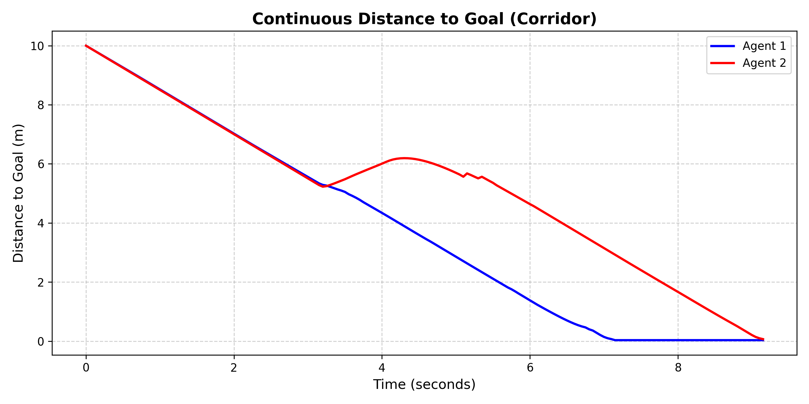
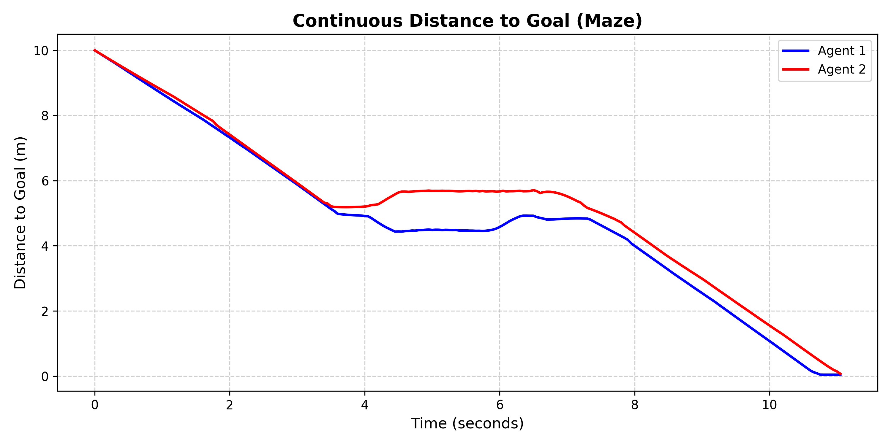
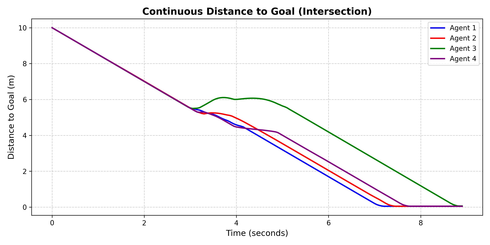

# Decentralized Multi-Agent Path Planning with Continuous-Time ODEs

This repository implements a completely decentralized, continuous-time navigation architecture for multi-agent systems. It guarantees mathematically collision-free aggregation without relying on inter-agent communication or discrete state-machine switching.

## How It Works

* **Global Planning (RRT*):** Each agent computes an optimal, obstacle-free baseline path using an RRT* planner enhanced with Bridge Sampling to efficiently navigate narrow passages.
* **Local Planning & Deadlock Resolution (B-Splines & APF):** Agents track their global paths using a continuous Ordinary Differential Equation (ODE). The system utilizes Kinematic Artificial Potential Fields (APF) with velocity-scaled uncertainty bubbles to guarantee safety. When a symmetric deadlock is detected (e.g., agents meeting head-on), the system deterministically injects a 2-parameter continuous B-Spline perturbation. This smoothly breaks the deadlock and guarantees an asymptotic return to the optimal path once cleared.

## Showcase and Performance

### 1. Corridor Scenario

**Agent Performance:**
<video src="https://github.com/YOUR_USERNAME/YOUR_REPO/assets/corridor_animation.mp4" controls="controls" width="100%"></video>

**Distance to Goal Convergence:**

---

### 2. Maze Scenario

**Agent Performance:**
<video src="https://github.com/YOUR_USERNAME/YOUR_REPO/assets/maze_animation.mp4" controls="controls" width="100%"></video>

**Distance to Goal Convergence:**

---

### 3. Intersection Scenario

**Agent Performance:**
<video src="https://github.com/YOUR_USERNAME/YOUR_REPO/assets/intersection_animation.mp4" controls="controls" width="100%"></video>

**Distance to Goal Convergence:**
